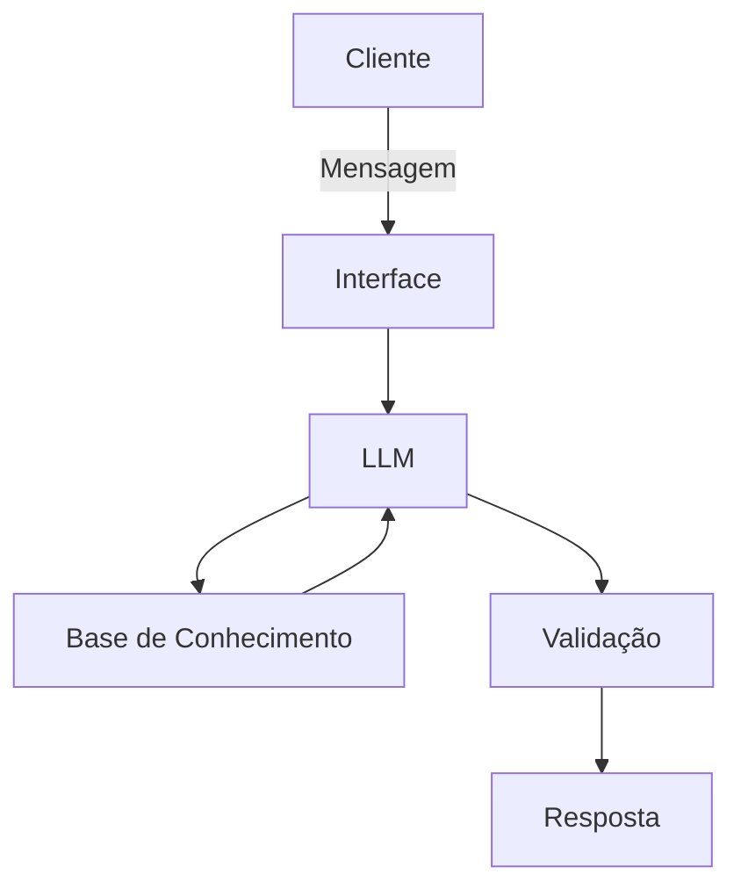

# Documentação do Agente

## Caso de Uso

### Problema
>O projeto SSP – Simplificando São Paulo busca solucionar a dificuldade que turistas e visitantes enfrentam ao explorar uma cidade tão grande e diversa quanto São Paulo.
Em 2025, a cidade registrou um recorde de turistas, aumentando a oportunidade de desenvolver ferramentas que facilitem a experiência desses visitantes. Guias turísticos tradicionais nem sempre conseguem atender às necessidades individuais dos usuários, especialmente quando existem preferências específicas de localização, gastronomia, entretenimento e experiências culturais.

### Solução
> O SSP é um assistente turístico baseado em Inteligência Artificial que entende as necessidades, preferências e interesses do usuário para recomendar locais e experiências em São Paulo.
Por meio de uma conversa interativa, o agente identifica o que o visitante procura e utiliza uma base de conhecimento com dados sobre pontos turísticos, restaurantes e locais de entretenimento para oferecer sugestões contextualizadas.

[Sua descrição aqui]

### Público-Alvo
*Turistas nacionais e internacionais que visitam São Paulo.

*Pessoas que desejam conhecer melhor a cidade.

*Visitantes que procuram atrações turísticas, restaurantes, bares, parques e espaços culturais.

*Usuários que desejam recomendações personalizadas de acordo com seus interesses.

*Pessoas que precisam de auxílio para planejar passeios e descobrir novas experiências na cidade.

---
### Nome do Agente
SSP - Simplificando São Paulo

### Personalidade
> O agente possui uma personalidade amigável, prestativa, paciente e consultiva.
Seu comportamento busca se aproximar de um amigo que conhece a cidade e ajuda o visitante a descobrir lugares interessantes. Ele procura compreender as necessidades do usuário antes de apresentar recomendações, evitando respostas genéricas e priorizando sugestões relacionadas aos interesses apresentados.

### Tom de Comunicação
>O agente utiliza uma comunicação informal, acessível, acolhedora e descontraída.
Evita linguagem excessivamente técnica ou formal, priorizando explicações simples e objetivas. Seu objetivo é tornar a experiência de descoberta da cidade agradável, interativa e fácil de compreender.

[Sua descrição aqui]

### Exemplos de Linguagem
- Saudação: "E aí! Seja bem-vindo a São Paulo! Me conta, o que você gostaria de conhecer por aqui?"
- Confirmação: "Entendi! Você está procurando um lugar legal para passear e comer alguma coisa por perto, certo? Vou te ajudar a encontrar algumas opções."
- Recomendação: "Que tal conhecer alguns pontos turísticos que combinam com o que você está procurando? Separei algumas sugestões para você!"
- Personalização: "Boa! E você prefere algo mais cultural, um passeio ao ar livre ou um lugar para curtir a gastronomia paulistana?"
- Erro/Limitação: "Não encontrei essa informação na minha base de conhecimento no momento, mas posso te ajudar a descobrir outras opções em São Paulo!"

---

## Arquitetura

### Diagrama

### Componentes

| Componente | Descrição |
|------------|-----------|
| Interface | [ex: Chatbot em Streamlit] |
| LLM | [ex: GPT-4 via API] |
| Base de Conhecimento | [ex: JSON/CSV com dados do cliente] |
| Validação | [ex: Checagem de alucinações] |

---

## Segurança e Anti-Alucinação

### Estratégias Adotadas

- [ ] [Utilização de uma base de conhecimento com dados estruturados para orientar as recomendações.]
- [ ] [Priorização de respostas coerentes com as informações disponíveis nos arquivos CSV.]
- [ ] [Consideração das necessidades e preferências informadas pelo usuário durante a conversa.]
- [ ] [Utilização de prompts documentados para orientar o comportamento e as respostas do agente.]

### Limitações Declaradas
> O que o agente NÃO faz?

[Liste aqui as limitações explícitas do agente]
- Suas recomendações dependem das informações disponíveis na base de conhecimento fornecida pelo projeto.
- Os dados utilizados são mockados e podem não representar informações atualizadas sobre os estabelecimentos e atrações.
- Não deve inventar informações sobre locais, serviços ou atrações que não estejam disponíveis em sua base de conhecimento.
- Não garante disponibilidade, horários de funcionamento, preços ou condições de acesso em tempo real.
- Não realiza reservas, compras de ingressos ou transações financeiras.
